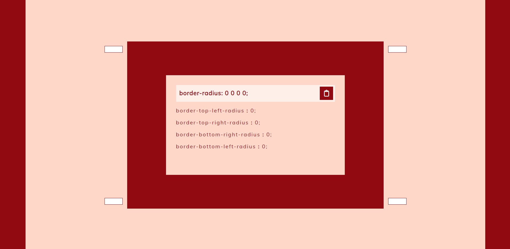
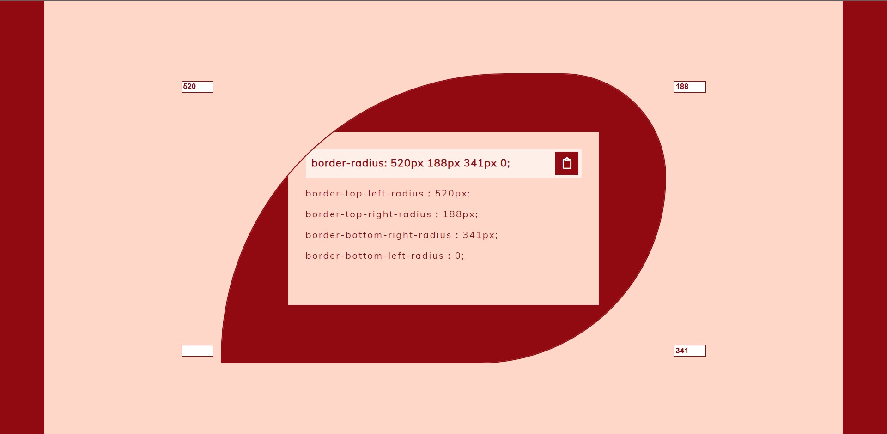

# Border-radius Previewer

Idea from [here](https://github.com/florinpop17/app-ideas/edit/master/Projects/1-Beginner/Border-Radius-Previewer.md).

The border-radius property can have multiple values changed. Preview how the shape looks while changing these values.

### Future Plans

- [ ] To add a slider that enable custom size of box on which border-radius property apply

### Bonus features

- [ ] User can change all 8 possible values of the border-radius in order to create a complex shape

### Screenshot

&nbsp;

